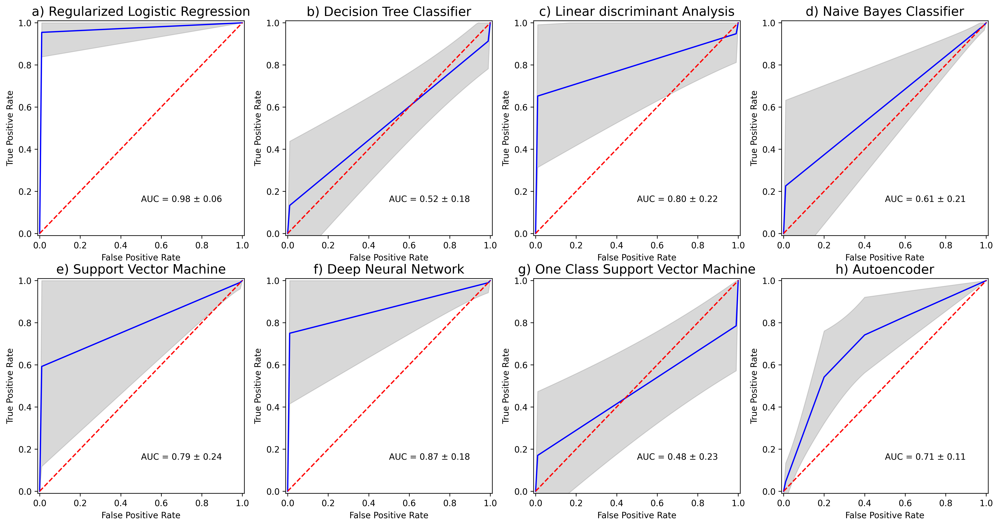

# Prediction of subthalamic deep brain stimulation motor outcomes for Parkinson‘s disease patients

Radziunas A., Saudargiene A., et al. 2022

The goal of the study is to predict the subthalamic nucleus (STN) deep brain stimulation (DBS) outcomes for Parkinson’s disease (PD) patients using the selected radiomic features extracted from pre-operative magnetic resonance images. Minimum Redundancy Maximum Relevance (mRMR) feature selection method was used to select the most relevant features out of 5040 total radiomic features. The resulting 20 features were used to discriminate the patients into two classes of poor vs good/very good STN-DBS motor outcome using statistical and machine learning algorithms.

The codes provided implement 8 statistical and machine learning algorithms for STN-DBS motor outcome prediction together with the accuracy visualization. 

## Prerequisites

The code was developed and tested on Windows with Python 3.7.  
Install required libraries:
```
pip3 install -r requirements.txt
```

## Usage

### 1. DBS outcome prediction

```
python prediction_DBS_output.py 
```
will run 8 statistical and machine learning algorithms to discriminate between poor vs good/very good STN-DBS motor outcome:

```
0 - Binary Logistic Regression
1 - Linear Discriminant Analysis
2 - Naive Bayes Classifier
3 - Decision Tree Classifier
4 - Support Vector Machine
5 - Deep Neural Network
6 - Onle Class Support Vector Machine
7 - Deep Autoencoder
```

### 2. Data visualization 

```
python Fig2_radiomic_features_boxplots.py
```
will show the boxplots of the selected radiomic features in two classes: poor DBS outcome vs good/very good DBS outcome:


```
python Fig3_radiomic_features_correlations.py
```
will present Spearman correlation coefficients between the selected radiomic features:


```
python Fig4_ROC.py
```
will plot ROC of 8 statistical and machine learning algorithms for STN-DBS motor outcome prediction:


## References
Article under revision:  
Radziunas A., Saudargiene A., et al. "Radiomic features of amygdala nuclei and hippocampus subfields help to predict subthalamic deep brain stimulation motor outcomes for Parkinson‘s disease patients.", 2022

